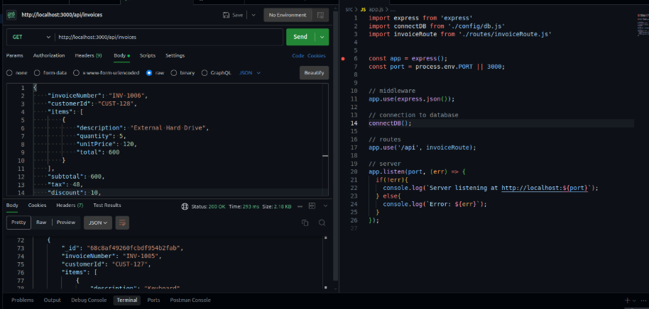

# Invoice Microservice



A robust, scalable, and production-ready invoice management microservice built with Node.js, Express.js, and MongoDB. This service provides a comprehensive REST API for creating, managing, and tracking invoices with full CRUD operations.

## Features

- **Complete CRUD Operations**: Create, read, update, and delete invoices
- **RESTful API**: Clean and intuitive REST endpoints
- **MongoDB Integration**: Leveraging Mongoose ODM for efficient data modeling
- **Express.js Framework**: Fast, unopinionated, minimalist web framework
- **Environment Configuration**: Secure environment variable management
- **Error Handling**: Comprehensive error handling and response formatting
- **Modular Architecture**: Clean separation of concerns with services, routes, and models

## Prerequisites

Before you begin, ensure you have the following installed:

- **Node.js** (v16 or higher)
- **MongoDB** (v4.4 or higher)
- **npm** or **yarn** package manager

## Installation

### 1. Clone the Repository

```bash
git clone https://github.com/your-username/invoice-microservice.git
cd invoice-microservice
```

### 2. Install Dependencies

```bash
npm install
```

### 3. Environment Setup

Create a `.env` file in the root directory and add the following environment variables:

```env
PORT=3000
MONGO_URI=mongodb://localhost:27017/invoice_db
NODE_ENV=development
```

### 4. Start MongoDB

Ensure MongoDB is running on your system. You can start it with:

```bash
# For MongoDB installed locally
sudo systemctl start mongod

# Or using Docker
docker run -d -p 27017:27017 --name mongodb mongo:latest
```

## Running the Application

### Development Mode

```bash
npm run dev
```

The server will start on `http://localhost:3000` with hot-reload enabled.

### Production Mode

```bash
npm start
```

## API Documentation

### Base URL
```
http://localhost:3000/api
```

### Endpoints

#### Create Invoice
- **POST** `/invoices`
- **Description**: Create a new invoice
- **Request Body**:

```json
{
  "invoiceNumber": "INV-2024-001",
  "customerId": "customer123",
  "items": [
    {
      "description": "Web Development Services",
      "quantity": 40,
      "unitPrice": 75.00,
      "total": 3000.00
    }
  ],
  "subtotal": 3000.00,
  "tax": 240.00,
  "discount": 0.00,
  "totalAmount": 3240.00,
  "currency": "USD",
  "status": "pending",
  "dueDate": "2024-12-31T23:59:59.000Z",
  "notes": "Payment due within 30 days"
}
```

#### Get All Invoices
- **GET** `/api/invoices`
- **Description**: Retrieve all invoices
- **Response**: Array of invoice objects

#### Get Invoice by ID
- **GET** `/api/invoices/:id`
- **Description**: Retrieve a specific invoice by its ID
- **Parameters**: `id` (MongoDB ObjectId)

#### Update Invoice
- **PUT** `/api/invoices/:id`
- **Description**: Update an existing invoice
- **Parameters**: `id` (MongoDB ObjectId)
- **Request Body**: Updated invoice data

#### Delete Invoice
- **DELETE** `/api/invoices/:id`
- **Description**: Delete an invoice
- **Parameters**: `id` (MongoDB ObjectId)

### Invoice Data Model

```javascript
{
  "id": "String",
  "invoiceNumber": "String",
  "customerId": "String",
  "items": [
    {
      "description": "String",
      "quantity": "Number",
      "unitPrice": "Number",
      "total": "Number"
    }
  ],
  "subtotal": "Number",
  "tax": "Number",
  "discount": "Number",
  "totalAmount": "Number",
  "currency": "String",
  "status": "String",
  "dueDate": "Date",
  "paymentDate": "Date",
  "notes": "String",
  "createdAt": "Date",
  "updatedAt": "Date"
}
```

## Project Structure

```
invoice-microservice/
├── src/
│   ├── config/
│   │   └── db.js              # Database connection configuration
│   ├── model/
│   │   └── invoice.js         # Mongoose invoice model
│   ├── routes/
│   │   └── invoiceRoute.js    # Express route definitions
│   ├── services/
│   │   └── invoiceService.js  # Business logic layer
│   └── app.js                  # Express application setup
├── public/
│   └── image.png               # Project documentation image
├── .env                        # Environment variables (not committed)
├── .gitignore                  # Git ignore rules
├── LICENSE                     # MIT License
├── package.json               # Project dependencies and scripts
├── package-lock.json          # Dependency lock file
└── README.md                   # This file
```

## Testing

Currently, the project includes a placeholder test script. To add comprehensive testing:

```bash
# Install testing dependencies
npm install --save-dev jest supertest mongodb-memory-server

# Run tests
npm test
```

## Technologies Used

- **Node.js**: JavaScript runtime environment
- **Express.js**: Web application framework
- **MongoDB**: NoSQL database
- **Mongoose**: MongoDB object modeling tool
- **dotenv**: Environment variable management
- **nodemon**: Development utility for auto-restarting server

## Environment Variables

| Variable | Description | Default | Required |
|----------|-------------|---------|----------|
| `PORT` | Server port number | `3000` | No |
| `MONGO_URI` | MongoDB connection string | - | Yes |
| `NODE_ENV` | Environment mode | `development` | No |

## Contributing

1. Fork the repository
2. Create a feature branch (`git checkout -b feature/amazing-feature`)
3. Commit your changes (`git commit -m 'Add some amazing feature'`)
4. Push to the branch (`git push origin feature/amazing-feature`)
5. Open a Pull Request

## License

This project is licensed under the MIT License - see the [LICENSE](LICENSE) file for details.

## Acknowledgments

- Built with modern JavaScript (ES6+) and Node.js best practices
- Follows REST API design principles
- Implements clean architecture patterns

## Support

For support, please open an issue in the GitHub repository or contact the development team.

---

**Built to scale by Eyiowuawi Timileyin**